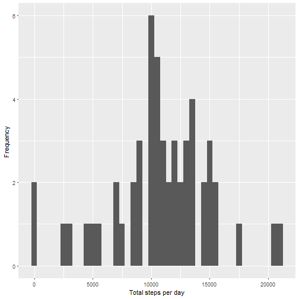
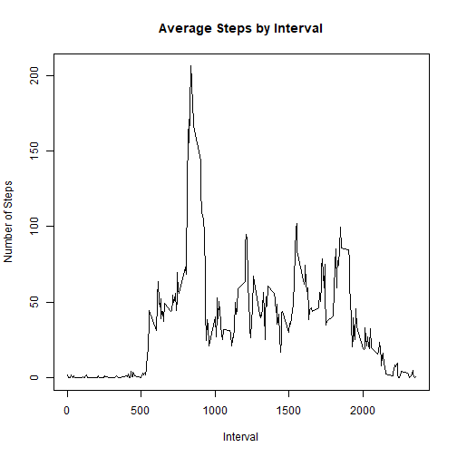
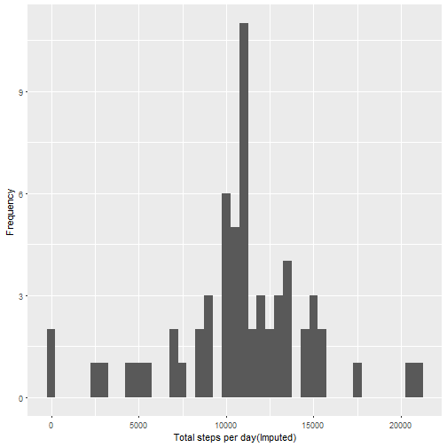
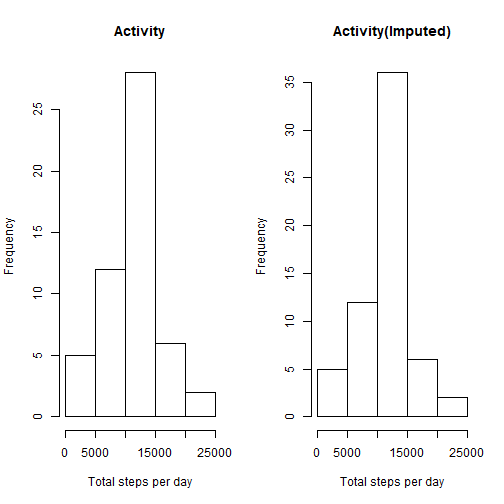
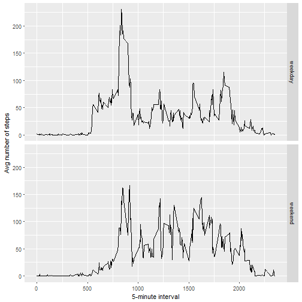

##Loading and preprocessing the data  
1. Load the data (i.e. read.csv())

```r
if(!file.exists('activity.csv')){
    unzip('activity.zip')
}
ActivityData <- read.csv('activity.csv')
```


##What is mean total number of steps taken per day?  
1. Sum steps taken by day

```r
StepsPerDay <- aggregate(steps ~ date, ActivityData, sum)
```
2. Histogram of the total number of steps taken each day  

```r
qplot(StepsPerDay$steps, xlab='Total steps per day', ylab='Frequency ', binwidth=500)
```



3. Mean and Median total number of steps taken per day  

```r
StepsPerDayMean <- mean(StepsPerDay$steps)
StepsPerDayMedian <- median(StepsPerDay$steps)
```
Steps per Day (Mean): 1.0766189 &times; 10<sup>4</sup>    
Steps Per day (Median): 10765    

##What is the average daily activity pattern?  
1.Calculate average steps for each interval for all days.  

```r
StepsPerInterval <- aggregate(steps ~ interval, ActivityData, mean)
```

2.Time series plot of the average number of steps taken  

```r
plot(StepsPerInterval$interval,StepsPerInterval$steps, type="l", xlab="Interval", ylab="Number of Steps",main="Average Steps by Interval")
```



```r
MaxStepInterval <- StepsPerInterval[which.max(StepsPerInterval$steps),1]
```
The 5-minute interval that, on average, contains the maximum number of steps : 835 


##Imputing missing values
1. Calculate and report the total number of missing values in the dataset  

```r
NumMissingValues <- length(which(is.na(ActivityData$steps)))
```
Number of missing values: 2304  

2. Histogram of the total number of steps taken each day after missing values are imputed   
Missing values were imputed by inserting the average for each interval. Thus, if an interval 'x' was missing on 10-02-2012, NA was repalced by the average for that interval 'x' for all days  


```r
ImputedActivityData <- transform(ActivityData, steps = ifelse(is.na(ActivityData$steps), StepsPerInterval$steps[match(ActivityData$interval, StepsPerInterval$interval)], ActivityData$steps))
ImputedStepsPerDay <- aggregate(steps ~ date, ImputedActivityData, sum)  
qplot(ImputedStepsPerDay$steps, xlab='Total steps per day(Imputed)', ylab='Frequency ', binwidth=500)       
```


  
3. Comparing Activity before and after imputed    

```r
par(mfrow=c(1,2))
hist(StepsPerDay$steps,main = 'Activity', xlab='Total steps per day', ylab='Frequency ')
hist(ImputedStepsPerDay$steps, main = 'Activity(Imputed)', xlab='Total steps per day', ylab='Frequency ')
```



4. Mean and Median total number of steps taken per day  

```r
ImputedStepsPerDayMean <- mean(ImputedStepsPerDay$steps)
ImputedStepsPerDayMedian <- median(ImputedStepsPerDay$steps)
```
Imputed Steps per Day (Mean): 1.0766189 &times; 10<sup>4</sup>    
Imputed Steps Per day (Median): 1.0766189 &times; 10<sup>4</sup>


## Are there differences in activity patterns between weekdays and weekends?
1. Create a new factor variable in the dataset indicating if given date is a weekday or weekend day.

```r
ImputedActivityData$dateType <-  ifelse(as.POSIXlt(ImputedActivityData$date)$wday %in% c(0,6), 'weekend', 'weekday')
```
2. Plot showing difference between weekday and weekends

```r
AvgActivityDataImputed <- aggregate(steps ~ interval + dateType, data=ImputedActivityData, mean)
ggplot(AvgActivityDataImputed, aes(interval, steps)) + 
    geom_line() + 
    facet_grid(dateType ~ .) +
    xlab("5-minute interval") + 
    ylab("Avg number of steps")
```




